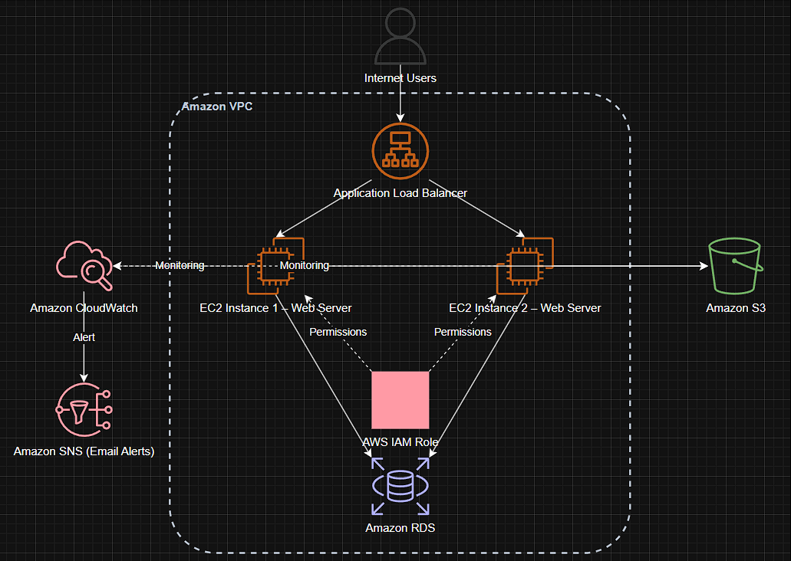
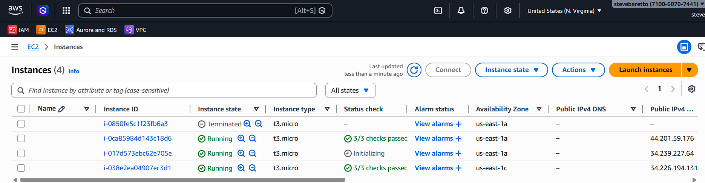

# AWS DevOps Web Application

## Project Overview

This project demonstrates how to deploy a scalable web application on AWS using core DevOps services. The infrastructure is designed to run inside a secure Amazon VPC with monitoring, alerting, and storage services integrated.

The architecture ensures high availability, monitoring, and efficient resource management.

---

## Architecture Diagram

---

## Architecture Description

The architecture consists of the following components:

1. **User**

   * End users access the web application through the internet.

2. **Application Load Balancer**

   * Distributes incoming traffic across multiple EC2 instances.

3. **EC2 Instances**

   * Two EC2 instances host the web application.
   * Instances are monitored for performance and availability.

4. **Amazon RDS**

   * Stores application data using a managed relational database.

5. **Amazon S3**

   * Used for storing static files, backups, or project assets.

6. **CloudWatch Monitoring**

   * Monitors CPU utilization and system metrics of EC2 instances.

7. **SNS Alerts**

   * Sends email notifications when CloudWatch alarms are triggered.

8. **IAM Permissions**

   * Allows EC2 instances to securely access S3 resources.

9. **Amazon VPC**

   * All services are deployed inside a Virtual Private Cloud for network security.

---

## AWS Services Used

* Amazon EC2
* Amazon RDS
* Amazon S3
* Application Load Balancer
* Amazon CloudWatch
* Amazon SNS
* AWS IAM
* Amazon VPC

---
## Project Screenshots

### EC2 Instances

Web servers running on Amazon EC2.

---

### RDS Database

Managed database used by the application.

---

### S3 Storage

Static files stored in S3 bucket.

---

### CloudWatch Monitoring

CPU utilization monitoring for EC2 instances.

---

### SNS Alert Notification

Email notification triggered when CPU utilization crosses threshold.

---
## Project Implementation Steps

### 1. Launch EC2 Instances

Two EC2 instances were created to host the web application.

### 2. Configure Load Balancer

An Application Load Balancer was configured to distribute traffic between EC2 instances.

### 3. Create RDS Database

A managed relational database was created using Amazon RDS.

### 4. Configure S3 Storage

An S3 bucket was created to store static files and project data.

### 5. Set Up IAM Roles

IAM roles were configured to allow EC2 instances to access the S3 bucket securely.

### 6. Enable Monitoring

CloudWatch monitoring was enabled to track EC2 CPU usage and system performance.

### 7. Configure Alerts

SNS was configured to send email notifications when CloudWatch alarms trigger.

---

## Monitoring and Alerts

Monitoring is implemented using:

* CloudWatch Metrics
* CPU Utilization Monitoring
* SNS Email Notifications

Alerts are triggered when the CPU utilization crosses a defined threshold.

---

## Security

The infrastructure is secured using:

* VPC network isolation
* IAM roles and policies
* Controlled access to S3 resources

---

## Skills Demonstrated

* AWS Infrastructure Deployment
* DevOps Monitoring and Alerting
* Load Balancing
* Cloud Storage Integration
* IAM Access Management

---

## Author

DevOps Cloud Project
Built using AWS services for hands-on DevOps learning.
