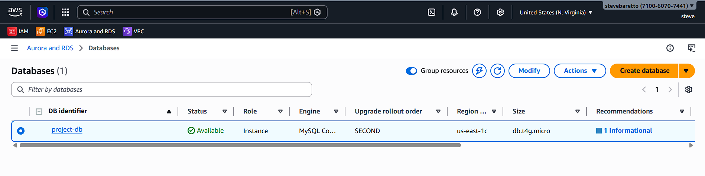
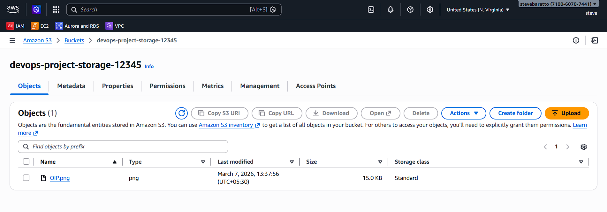
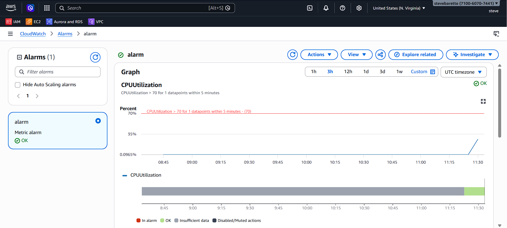
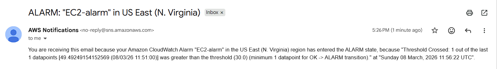

# AWS DevOps Web Application

## Project Overview

This project demonstrates how to deploy a scalable web application on AWS using core DevOps and cloud services. The architecture includes compute, storage, database, monitoring, and notification services to ensure high availability and performance.

---

## Architecture

The application is deployed using the following AWS services:

* Amazon EC2 – Hosting the web application
* Amazon RDS – Managed relational database
* Amazon S3 – Storage for static files
* Elastic Load Balancer – Traffic distribution
* Amazon CloudWatch – Monitoring and logging
* Amazon SNS – Alert notifications

Architecture Flow:

User → Load Balancer → EC2 Web Server → RDS Database → S3 Storage

---

## AWS Services Used

* EC2
* RDS
* S3
* CloudWatch
* SNS
* Application Load Balancer

---

## Project Screenshots

### Architecture Diagram

### EC2 Instance Running

### Web Application

### RDS Database

### S3 Bucket

### CloudWatch Monitoring

### SNS Notification

---

## Deployment Steps

1. Launch an EC2 instance.
2. Install and configure the web server.
3. Create an RDS database instance.
4. Store static files in an S3 bucket.
5. Configure an Application Load Balancer.
6. Enable monitoring using CloudWatch.
7. Set up email alerts using SNS.

---

## Skills Demonstrated

* AWS Cloud Infrastructure
* DevOps Deployment
* Cloud Monitoring
* Load Balancing
* Infrastructure Documentation

---

## Author

DevOps Engineer Portfolio Project

